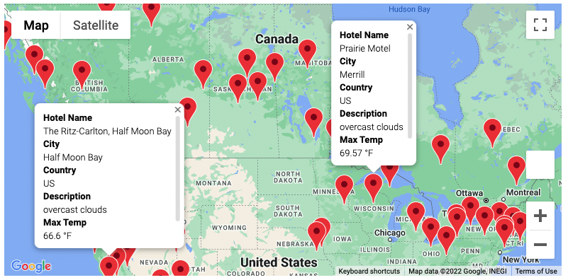
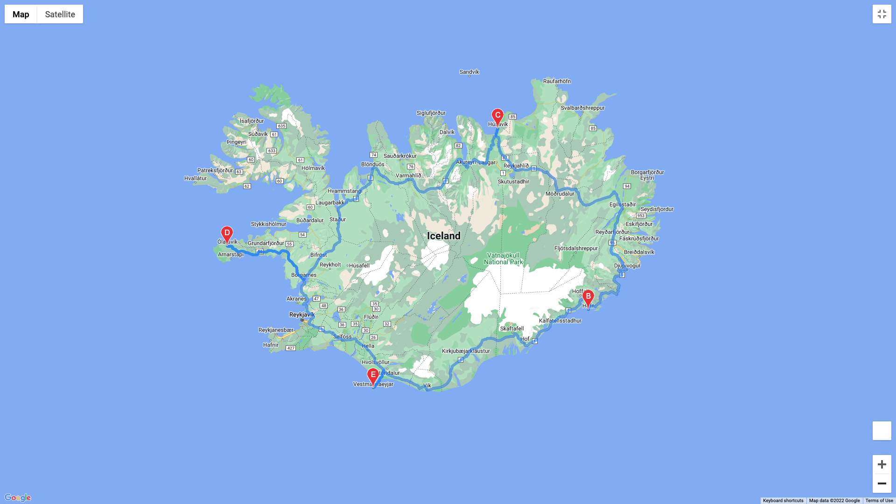
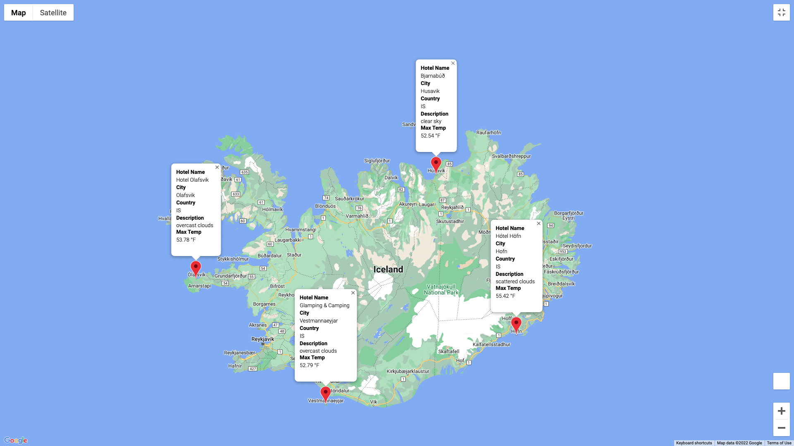

# World_Weather_Analysis

## Overview
The PlanMyTrip app helps vacationers identify their next getaway based on their weather preferences. From a list of potential travel destinations, the user can choose four cities to create a travel itinerary. Using the Google Maps Directions API, I created a travel route between the four cities and displayed them on a map.

## Process

### Retrieving Weather Data
I first generated a set of 2,000 random latitudes and longitudes. From those coordinates, I could retrieve the nearest city with CityPy, and performed an API call with the OpenWeatherMap to gather the following data for each location:
- Latitude and longitude
- Maximum temperature
- Percent humidity
- Percent cloudiness
- Wind speed
- Weather description

The resulting data was stored in a dataframe and exported in this csv: [Weather Database](weather_database/WeatherPy_Database.csv).

### Creating a Customer Travel Destination Map
I then used this raw data to build a vacation search function that took the user's input for their preferred vacation temperature (max & min). The DataFrame would filter to this critera and search for the nearest hotels. The user's critera displays on a map with markers and info boxes showing the Hotel Name, City, Country, and Current Weather conditions: 
.

### Creating a Travel Itinerary Map
Using the Google Directions API, I plotted driving directions to four selected cities in Iceland and mapped the route with markers:

